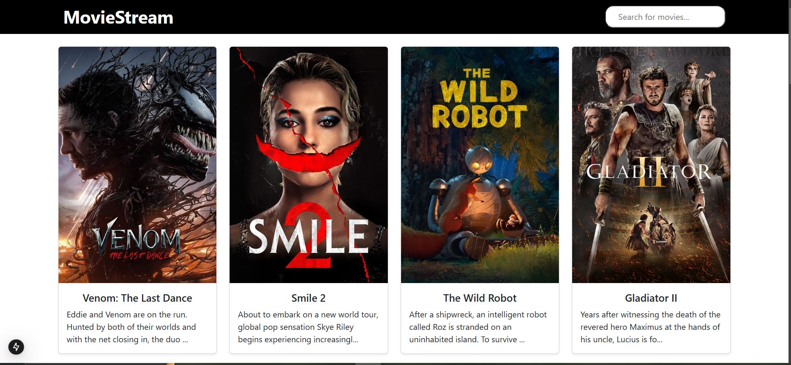
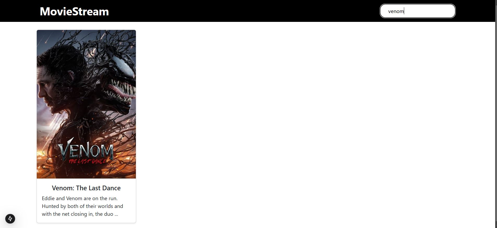

# Next MOVIE_STREAMING_app
<p>This platform is a **movie streaming site** that allows users to explore and watch movies that are currently popular. On the homepage, users will be presented with a grid of trending movies fetched from the TMDb API, ensuring they see the most popular titles at any given time. Each movie is displayed with its poster, title, and a brief description, making it easy to discover new films. Users can click on any movie to be taken to a **movie details page**, where they can view in-depth information such as the movie's overview, genres, release date, and other details, along with larger images of the poster or backdrop.
Additionally, the platform includes a search functionality, allowing users to search for specific movies by name using the search bar at the top of the site. When a search query is entered, the platform queries the TMDb API and displays matching results in a grid layout. This makes it easy for users to find any movie they are looking for. The combination of a dynamic movie grid and detailed movie pages, along with the search functionality, makes this platform a comprehensive tool for movie enthusiasts to explore the latest films.<p>

## TO Run Project

### Step 1: Run the react app 
```bash
npm run dev
```




